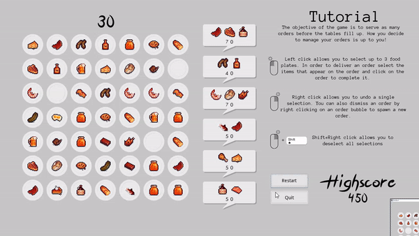

# LD42 Gamejam Game build using Godot 3.0.6 using C#

This is the source code for a puzzle game built using godot 3.0 and c#. It requires a nuget package to run.

If you want to give it a shot head over to itch.io for a build of the actual game. [Download Here!](https://g4mr.itch.io/shortserve-ld42 "GodotSharp 3.0 C# Puzzle Game")

# Notes before opening project & building

- You need to run nuget to restore the nuget packages. Use the following command: `nuget restore ShortServe.sln`

Enjoy, I love Godot 3!